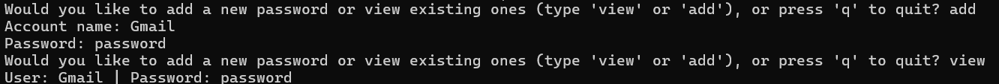
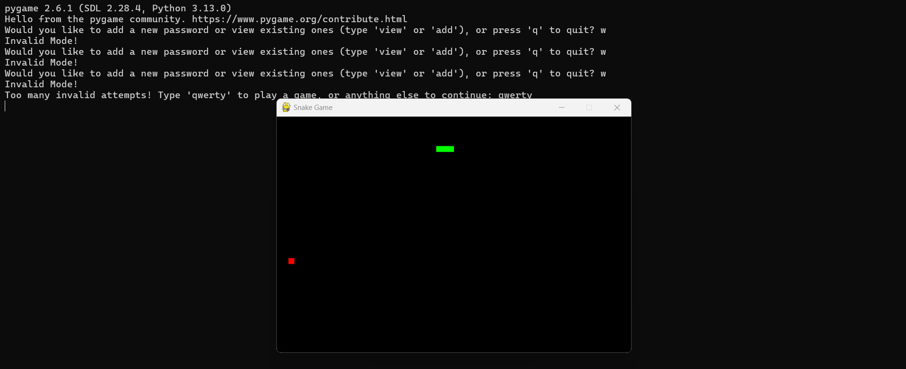

# 🔐 Mohit's Password Manager & 🐍 Snake Game

Welcome to **Mohit's Password Manager**! This unique project combines password management with a classic Snake Game challenge for extra security fun! Three wrong attempts, and you’ll need to beat the Snake Game to continue. 🕹️

## 🎉 Features

### Password Manager 🔑
- **Add** new accounts and securely encrypt passwords.
- **View** all saved passwords (decrypted for easy access).
- **Error Handling**: Too many invalid actions activate a game challenge!

### Snake Game 🐍
- **Classic Snake Gameplay** built with Pygame.
- **Dynamic Challenge**: Win to reset your error count and regain access.
- **Fun and Functionality**: Enjoy a game to unlock access after failed attempts!

---
## Results
<p align="center">
 
     
</p>

---

## 🛠️ Installation & Setup

### Prerequisites
Ensure Python is installed and then install the required libraries:
```bash
pip install cryptography pygame
```

### Running the Program
Run the project by navigating to its folder and using:
```bash
python <your_script_name>.py
```

---

## 🚀 Usage

### Adding and Viewing Passwords

When you start the program, choose to **add** a new password or **view** existing ones:

```python
mode = input(
    "Would you like to add a new password or view existing ones (type 'view' or 'add'), or press 'q' to quit? ").lower()
```

- **Add**: Save a new account name and password.
- **View**: Retrieve all saved passwords (decrypted).
- **Quit**: Type `q` to exit.

### Encryption & Decryption

Passwords are **encrypted** before storage and decrypted for viewing. Here’s a snippet of the encryption and decryption functionality:

```python
from cryptography.fernet import Fernet

# Load or generate a key
def write_key():
    key = Fernet.generate_key()
    with open("key.key", "wb") as key_file:
        key_file.write(key)

def load_key():
    with open("key.key", "rb") as file:
        return file.read()

key = load_key()
fer = Fernet(key)

# Encrypt and decrypt passwords
def add_password(account_name, password):
    encrypted_password = fer.encrypt(password.encode()).decode()
    with open('passwords.txt', 'a') as f:
        f.write(account_name + "|" + encrypted_password + "\n")

def view_passwords():
    with open('passwords.txt', 'r') as f:
        for line in f.readlines():
            account, encrypted_password = line.strip().split("|")
            decrypted_password = fer.decrypt(encrypted_password.encode()).decode()
            print(f"Account: {account} | Password: {decrypted_password}")
```

### Challenge Mode with Snake Game

After three invalid attempts, play the Snake Game to reset your error count and regain access:

```python
def snake_game():
    # Initialize Pygame, set up display and main game loop here...
    pass  # Your snake game code will go here.
```

---

Thank you for using **Mohit's Password Manager** with **Snake Game Challenge**. Enjoy the security and the fun!

